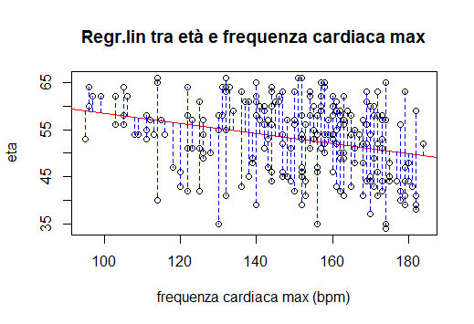

# Data-Analysis-Heart-Disease-Dataset

## INDICE
1. Introduzione e obiettivi
2. Descrizione del dataset
3. Analisi dei dati (tecnicamente corretti e consistenti)
4. Analisi descrittiva
5. Regressione lineare
6. Machine Learning
7. Conclusioni 


## 1. Introduzione e obiettivi

*“Se i dati e la teoria non concordano, cambia i dati.”*

cit. Albert Einstein

Nel nostro caso non cambieremo drasticamente i dati, ma apporteremo le dovute correzioni in modo tale da utilizzare un dataset pulito, consistente e corretto, come ad esempio: rinominare le colonne, rinominare e ordinare i livelli dei fattori, controllare e rimuovere i valori NA, trasformare i dati in modo che siano consistenti (appartenenti al dominio della variabile).
Successivamente l’impegno ricadrà sulla visualizzazione dei dati nella maniera più opportuna ed esplicativa. 

Analizzeremo la relazione tra due variabili del dataset attraverso la regressione lineare per determinare e visualizzare:
1.	la retta, con tutte le sue caratteristiche
2.	il grafico del modello
3.	il tipo di relazione tra le variabili

Esporremo due diversi algoritmi, quello di forza bruta e quello del gradiente, per l’analisi della relazione tra le variabili scelte che costituiscono un modello di regressione lineare.
Infine tramite lo studio e l’utilizzo di algoritmi di Machine Learning illustreremo i risultati da noi ottenuti. 

## 2. Descrizione del dataset

Il dataset utilizzato per questo progetto è un estratto di “Heart Disease Data Set” che fa riferimento a questo link:
https://archive.ics.uci.edu/ml/datasets/Heart+Disease. 
Questi sono tutti i dati che avevamo a disposizione all’interno del dataset:
1.	**x** → ID: rappresenta l’età della persona
2.	**age** → età: rappresenta l’età della persona
3.	**sex** → sesso: rappresenta il sesso della persona dove se:
Il valore è  uguale a 1 allora è un “Maschio”
Il valore è uguale a 2 allora è una “Femmina”
4.	**cp** → dolore_petto: viene indicata la tipologia del dolore dove se:
Il valore è uguale a 1 allora si tratta di un “Infarto”
Il valore è uguale a 2 allora si tratta di un “Rischio infarto”
Il valore è uguale a 3 allora si tratta di un “Dolore generico”
Il valore è uguale a 4 allora si tratta di un “Asintomatico”
5.	**trestbps** → press_sangue_riposo:  indica la pressione del sangue a riposo, espressa in mmHg
6.	**chol** → colesterolo: indica il tasso di colesterolo in mg/dl
7.	**fbs** → insulina: indichiamo se il tasso di insulina è maggiore di 120 mg/dl e vengono indicati con:
“1” che sta per “True” cioè l’insulina supera i 120 mg/dl
“2” che sta per “False” cioè l’insulina non supera i 120 mg/dl
8.	**restecg** → ECG_riposo: indica l’elettrocardiogramma quando la persona è a riposo, dove:
Se il valore è uguale a 0 significa che è “Normale”
Se il valore è uguale a 1 significa che è “Anormale”
Se il valore è uguale a 2 significa che si ha una “Ipertrofia ventricolare sx ”
9.	**thalach** → freq_cardiaca_max: indica la frequenza cardiaca massima della persona 
10.	**exang** → esercizi: indica se il dottore consiglia di effettuare esercizi per il dolore al petto e viene indicata con:
“1” che sta per “Si”
“0” che sta per “No”
11.	 **oldpeak** → vecchi_picchi: indica la depressione ST indotta dall’esercizio rispetto al riposo 
12.	**slope** → inclinazione_grafico: indica la pendenza del segmento ST di picco degli esercizi che vengono indicati con:
Il valore 1 che significa è in salita
Il valore 2 che significa che è piatta
Il valore 3 che significa che è in discesa
13.	**ca** → vasi_sang_colorati: indica il numero di vasi principali che si possono colorare tramite la fluoroscopia, può variare da 0 a 3
14.	**thal** → difetto: viene indicata da questi valori:
“3” che sta per “Normale”
“6” che sta per “Difetto fisso”
“7” che sta per “Difetto reversibile”
15.	**target** → obiettivo: indica se il paziente è sano o malato

## 3. Analisi dei dati (tecnicamente corretti e consistenti)

La trasformazione dei dati in modo che siano tecnicamente corretti e consistenti è molto importante per far sì che i grafici o i dati calcolati non siano errati ma siano il più precisi possibili, iniziando ad eliminare i valori NA. All’interno del dataset vi erano delle colonne con dei nomi poco chiari e quindi sono stati “tradotti” in modo da essere comprensibili, ad esempio: la colonna fbs in press_sangue_riposo, la colonna chol in colesterolo, ecc. 

Dobbiamo tener conto anche del fatto che i dati all’interno delle variabili devono essere del tipo corretto. Per esempio per la colonna chol (colesterolo) i dati saranno di tipo numerico dato che è una variabile di intervallo ed avrà anche un dominio di consistenza il quale dovrà essere rispettato per la consistenza dei dati.
Prendiamo in considerazione qualche grafico e diamogli un’occhiata:
Come si può notare qua sotto abbiamo il grafico della distribuzione dell'età. Notiamo che in questo boxplot abbiamo degli outlier, che sono dei dati inconsistenti.

PRIMA


Gli outlier inconsistenti, infatti, sono stati eliminati, poiché non esiste, ad esempio, una persona che abbia l’età minore di 0.

DOPO


Ora vediamo un’altro grafico, in questo caso abbiamo un istogramma che rappresenta la colorazione dei vasi sanguigni tramite la fluoroscopia.
PRIMA


Che cosa è cambiato dall'istogramma di PRIMA?
Ricordiamo che il valore della colorazione dei vasi sanguigni varia da 0 a 3 mentre nel grafico di PRIMA abbiamo una colonna “4”; questo lo rende un dato errato, quindi è stato eliminato.
DOPO


 
4. Analisi descrittiva

Ora procediamo con l’analisi di alcuni dei principali grafici che abbiamo costruito:

1. 


Notiamo come mediamente i pazienti maschili siano più giovani delle donne infatti lo scarto interquartile delle donne è maggiore di quello maschile, VAS e VAI femminili si discostano di meno dallo scarto interquartile rispetto alle registrazioni prese sui maschi.


 
2. 


l'età media femminile con un ECG a riposo normale si concentra tra i 50 e i 60 anni; la donna più giovane ha un ECG anormale. Lo scarto interquartile femminile di chi registra un ECG anormale è elevato. L'unica donna che soffre di ipertrofia ventricolare sx ha 55 anni circa. Per quanto riguarda gli uomini rileviamo scarti interquartili piuttosto ristretti e la media si aggira sempre sui 50 - 60 anni per chi ha un ECG normale, con molti casi che rientrano al di sotto del Q2. Possiamo notare che chi registra un ECG anormale ha una media di età minore di chi registra un ECG normale. L'unico caso maschile di ipertrofia registra circa 58 anni.

 


3. 


Dal grafico si evince che, con l'aumentare dell'età, le persone tendono ad avere meno patologie cardiache.. La differenza tra sani e malati si può notare soprattutto nel grafico femminile.


5. 


Da questa rappresentazione grafica comprendiamo che chi svolge esercizi è prevalentemente chi ha registrato un infarto o soffre di un dolore generico. Si notano anche molti infarti, rischi infarto e dolori generici che non vengono curati con esercizi.


6. 

Quest’ultimo grafico rappresenta la tabella di correlazione tra le variabili numeriche. Una correlazione alta rispetto alle altre, ad esempio, è quella tra vasi_sangu_colorati e età mentre è molto bassa quella tra vecchi_picchi e frq_cardiaca_max. 


## 5. Regressione lineare

Per lo sviluppo della regressione lineare, abbiamo scelto inizialmente di osservare se era presente una relazione tra pressione sanguigna a riposo e colesterolo. Il risultato ottenuto è il seguente:


Siccome la correlazione risulta molto bassa (circa 10%) e la varianza della relazione alta, abbiamo successivamente deciso di cambiare le variabili ed effettuare un’altra analisi della relazione, optando questa volta per età e frequenza cardiaca massima. Questa volta abbiamo ottenuto il seguente grafico:


La correlazione ottenuta questa volta è circa -30%, 3 volte superiore a quella del grafico precedente. Anche se si ha comunque un’alta dispersione, si può comunque notare che generalmente all’aumentare dell’età diminuisce la frequenza cardiaca massima, fenomeno ulteriormente verificato dall’analisi effettuata precedentemente sul plot tra le medesime variabili.
L’R2 ottenuto è comunque basso, 0.086, ma è migliore di quello della relazione tra colesterolo e pressione a riposo.
Successivamente, analizzando i residui, si può affermare che l’ipotesi di distribuzione casuale dei residui è verificata, in quanto essi risultano presenti sia sopra che sotto la retta.


 

 
Infine abbiamo costruito il grafico relativo alla distribuzione in quantili:


Anche il grafico dei quantili verifica l’ipotesi di distribuzione casuale dei valori poiché si distribuiscono sia sopra che sotto la linea.


 
## 6. Machine Learning
Per il nostro progetto gli algoritmi di Machine Learning che abbiamo utilizzato sono stati principalmente 3: LDA, CART, KNN e MLP.
Tutti e tre hanno ottenuto più o meno gli stessi risultati seppur con qualche lieve differenza. Abbiamo eseguito diverse prove utilizzando per ognuna di essa una combinazione delle variabili del dataset differente. Di seguito sono riportati i risultati della prima prova considerando tutti gli attributi eccetto ID:
Models: lda, cart, knn, mlp 
Number of resamples: 25 
```
Accuracy 
        Min.    1st Qu.     Median    Mean     3rd Qu.     Max.    NA's
lda  0.5000000 0.7142857 0.8571429 0.8292857 1.0000000 1.0000000    0
cart 0.2857143 0.6250000 0.7142857 0.7392857 0.8571429 1.0000000    0
knn  0.4285714 0.6250000 0.7142857 0.7342857 0.8571429 1.0000000    0
mlp  0.5000000 0.5714286 0.5714286 0.5571429 0.5714286 0.5714286    0

Kappa 
        Min.      1st Qu.   Median     Mean     3rd Qu.   Max.  NA's
lda   0.0000000 0.4166667 0.6956522 0.6450440 1.0000000    1     0
cart -0.4000000 0.2500000 0.4166667 0.4599621 0.7200000    1     0
knn  -0.2727273 0.2500000 0.4166667 0.4498903 0.6956522    1     0
mlp   0.0000000 0.0000000 0.0000000 0.0000000 0.0000000    0     0
```
L’algoritmo lineare LDA risulta essere il migliore dato che ha ottenuto un’accuratezza media del ~82%. LDA è un algoritmo di classificazione lineare semplice e potente che è concepito per risolvere tutti quei problemi di classificazione a due classi. Può essere esteso per la classificazione multiclasse, ma è usato raramente per questo scopo. 
Il tempo impiegato dalla macchina per la creazione del modello varia a seconda di quest'ultimo, si registra dopo varie prove un tempo medio di circa 0-1s.
Le ultime considerazioni che da fare sono le misurazioni dell’accuratezza effettiva del nostro test set, i risultati sono: 
```
Confusion Matrix and Statistics
Prediction	        Sano	     Problema cardiaco
Sano	               15	              3
Problema cardiaco    5	             21
                                      	
Accuracy : 0.8182      	
Kappa : 0.6303                	
Sensitivity : 0.7500      	
Specificity : 0.8750   	   
'Positive' Class : sano   
```

Otteniamo dunque un’accuratezza del 82% circa, una sensibilità del 75%, che misura quanto è adatto il modello a rilevare eventi nella classe positiva e una specificità del 87,5 %, ossia la percentuale di esattezza nell'assegnazione alla classe positiva.

## 7. Conclusioni
Possiamo affermare in conclusione che per questo progetto sono state utilizzate diverse librerie come tidyverse, ggplot2, gganimate, ggcorrplot e caret, che ci hanno permesso di svolgere il lavoro al meglio e di raggiungere l’obiettivo creando un buon modello di Machine Learning utilizzando il metodo LDA.
Grazie a questo progetto abbiamo appreso le meccaniche fondamentali di un'analisi ben strutturata a un dataset e, con una successiva implementazione di algoritmi di Machine Learning, uno studio approfondito dei complessi meccanismi di analisi tramite regressione lineare e algoritmi di Machine Learning volti a predire un determinato risultato.
